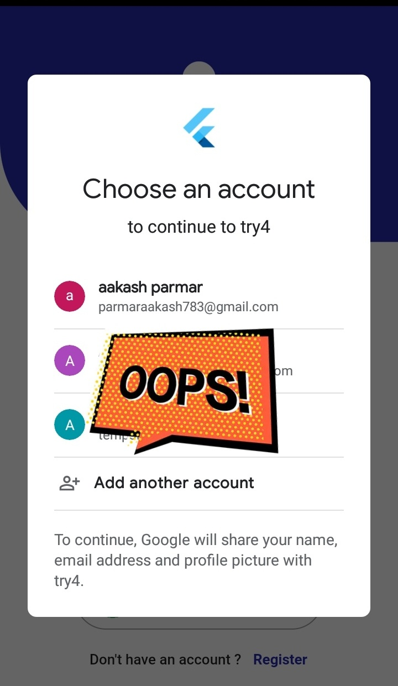
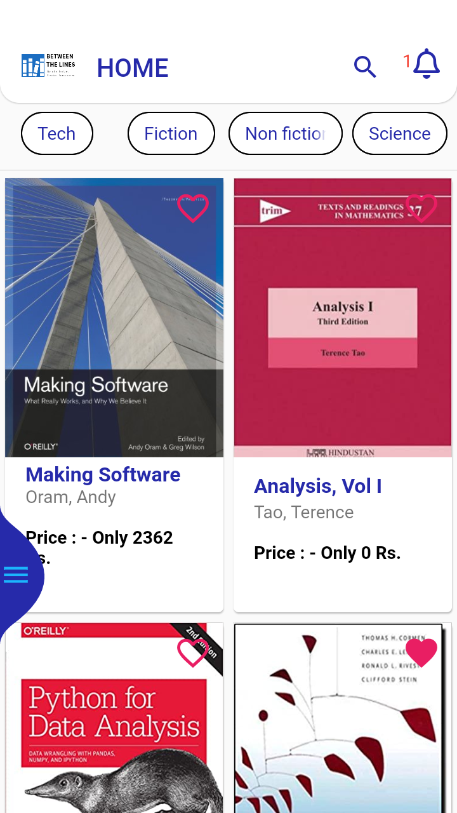
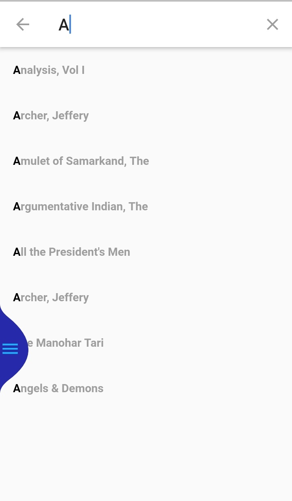
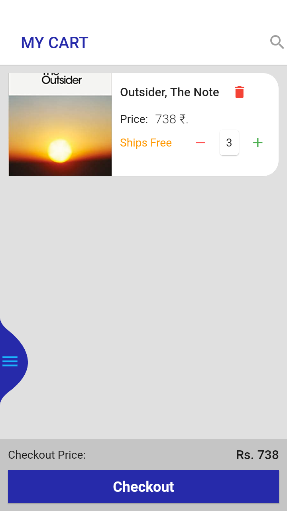
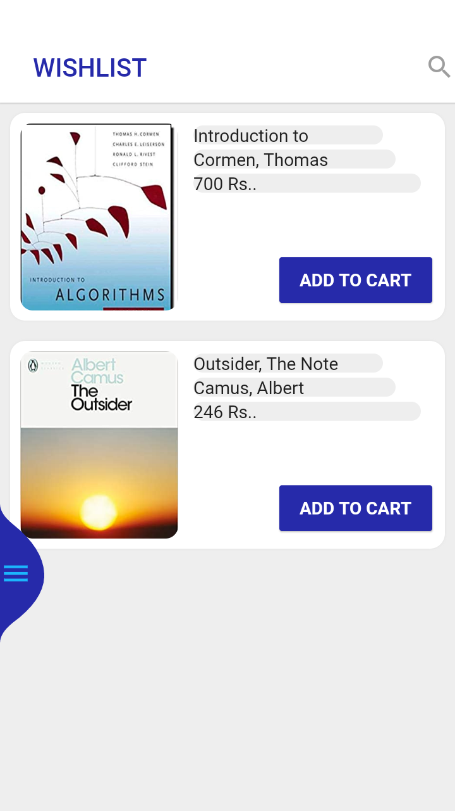
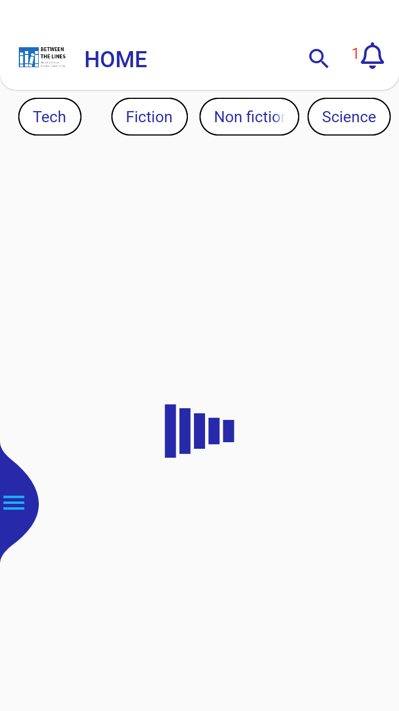

# BetweenTheLines-An-Ecommerce-App
Between The Lines - An Ecommerce app made using flutter. 

<h2>This app contains following features.</h2>
<ul>
  <li>Splash Screen</li>
  <li>Login and SignUp - Using Firebase O-Auth</li>
  <li>Home</li>
  <li>Routing</li>
  <li>Theme</li>
  <li>Details</li>
  <li>My Orders</li>
  <li>Cart</li>
  <li>My Wishlist</li>
  <li>Filter support to search specific types of books.</li>
  <li>Extensive search support.</li>
</ul>

<h2>Following are some of the screenshots of the app.</h2>
 
<table>
  <tr>
    <td>Login With Google Account</td>
    <td>Home Page</td>
  </tr>
  <tr>
    <td></img></td>
    <td></img></td>
  </tr>
</table>

 
<h4>Filteration.</h4>
 
<table>
  <tr>
    <td>Books by genre</td>
    <td>Suggestions</td>
  </tr>
  <tr>
    <td></img></td>
    <td></img></td>
  </tr>
</table>

<h4>Details.</h4>
 
<table>
  <tr>
    <td>Books Details</td>
  </tr>
  <tr>
    <td></img></td>
  </tr>
</table>

 
<h4>Mandatory features.</h4>
 
<table>
  <tr>
    <td>Cart</td>
    <td>My Wishlist</td>
  </tr>
  <tr>
    <td></img></td>
    <td></img></td>
  </tr>
</table>

 
<h4>Additionals.</h4>
 
<table>
  <tr>
    <td>User Info.</td>
    <td>On purcahse dialog</td>
    <td>Loading Screen</td>
  </tr>
  <tr>
    <td></img></td>
    <td></img></td>
    <td></img></td>
  </tr>
</table>

<h3>For more screenshots - goto Screenshots directory from the root of project.</a></h3>
Licensed under [MIT License.](LICENSE)
